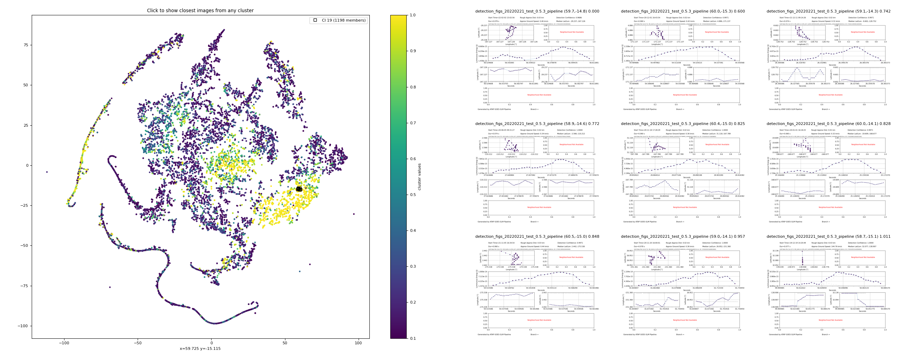
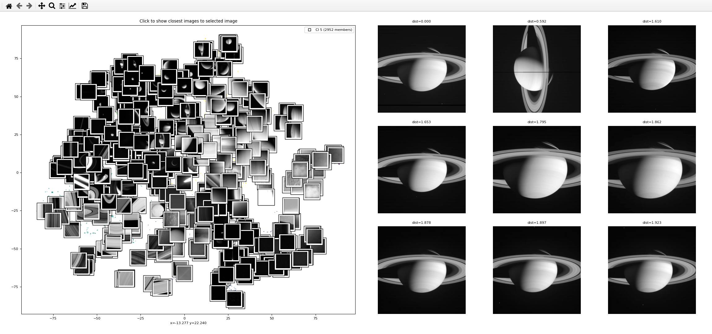

# Interactive Viewer

Interactive t-SNE Viewer is a tool that provides a way to visually view a data set's higher dimensional features in a 2-dimnensional space. One
can then select a data point in the representation and view nearest neighbors images associated with the data.

# Features

*Note: This tool is being used for specific custom research purposes. It has not been tested for general use and some
feature option might seem odd unless you understood the exact usae cases they have been developed for. In time, we hope
to produce a more generale purpose tool*

1. Either visualize a general higher dimensional data set or specifically a PyTorch Lightning SSL model.

2. An Interactive plot to view the nearest neighbor imagesof every data point in the hyper diensional space. Currently supports TSNE and UMAP. 
    The displayed images can either be images used to generate DNN embeddings, or any other data associated with the
    visualized data.

3. Select images to be coped in a seperate folder for creating a labelled data set. ONly binary labelling is
   currently possible.

3. Visualize data in 3D using the TensorBoard Embedding Projector.

# Installation

This is a Fork of [Interactive t-SNE](https://github.com/spaceml-org/Interactive-TSNE). It is in active development with
no formal releases and
so is recommended to install in development mode. There are different ways to do this. A simple way is to use the `-e`
option for pip. After activating your Python environment, in the top level directory of this repo type
```
pip install -e .
```

# Interactive Plot 


# Usage

There are two main usages:

### General multi-dimensional scalar feature set:

With this usage, you create a set of PNG figures and a higher dimensional feature set associated with each figure. The
feature set can be completely arbitrary. 
You need to first place all figures associated with the data points in a single directory. Then create a
multi-dimensional array to pass to t-SNE to create the visual 2-D representation.

```
from InteractivePlot.PrepareData import PrepareData_general
from InteractivePlot.Viewer import InteractivePlot

# Create the t-SNE representation and image table
data = PrepareData_general(data=image_features, image_path=images, image_sort_key=sort_key, num_clusters=20, method='tsne', perplexity=30)

# Generate t-SNE figure allowing one to view figures of closest points to selected point. 
p = InteractivePlot(clusters, data.tsne_results, data.image_mapping, nside=3)

```

**`PrepareData_general` parameters:**

`data` is the image representation data to cluster with t-SNE (or UMAP), of shape (n_datums, n_dimensions).

`image_path` is the path to PNG images, one image per datum.

`image_sort_key` is a list of strings used to sort the image files to correspond to the data in `image_features`
Each string should correspond to a unique string segment in each PNG figure filename.

`num_clusters` is the number of clusters to color code for visualization purposes. Uses a hierachical clustering method.

`method` is the manifold learnign method to use. Options: {'tsne', 'umap'}.

`perplexity` is the t-SNE perplexity parameter ('umap' uses `n_neighbors`).

**`InteractivePlot` parameters:**

'clusters' is a list of clusters (array of ints) used to colorize the t-SNE figure. 

'colors' is an optional parmater, if passed then use this color value array (array of floats) for the scatter plot and not the clusters

`nside` is the number of figures to show in a `nside x nside` grid.

See the module function headers for more details and more advanced usage.

Here is an example generated figure. The `colors=` optional argument is used to colorize the t-SNE points. 
One clicks first on a point in the t-SNE. The selected point image is shown in the upper
left corner and its nearest neighbors are also shown.


### PyTorch Lightning SSL model embeddings

The other usage mode is to supply a PyTroch Lightning model which generates embeddings to represent the data. The images
can be, but do not have to be, the images evaluated by the model.

```
from InteractivePlot.PrepareData import PrepareData_SSL_model
from InteractivePlot.Viewer import InteractivePlot

# Create the t-SNE representation and image mapping
data = PrepareData_SSL_model(model_path=model_path, technique='SIMCLR', image_path=image_path, num_clusters=5, method='tsne', perplexity=30, n_jobs=10)

# Generate t-SNE figure allowing one to view figures of closest points to selected point. 
p = InteractivePlot(data.clusters, data.tsne_results, data.image_mapping, nside=3, colors=None, plot_thumbnails=True, thumbnail_size=32, plot_max_n_thumbnails=500, save_selection_path='./selected_images')

```

**`PrepareData_SSL_model` parameters:**

`model_path` is the path to the PyTorch Lightning model.

`technique` is the SSL technique used, options are specified by `self_supervised_learner.SSL.supported_techniques` in 
the [SSL package here](https://github.com/jcsmithhere/pds-ml).

`image_path` is the path to PNG images, using standard torchvision directory structure.

`num_clusters` is the number of clusters to color code for visualization purposes. Uses a hierachical clustering method.

`method` is the manifold learnign method to use. Options: {'tsne', 'umap'}.

`perplexity` is the t-SNE perplexity parameter ('umap' uses `n_neighbors`).

`n_jobs` is the number of CPUs to use when computing the t-SNE representation.

**`InteractivePlot` parameters:**

'clusters' is a list of clusters (array of ints) used to colorize the t-SNE figure. 

'colors' is an optional parmater, if passed then use this color value array (array of floats) for the scatter plot and not the clusters

`nside` is the number of figures to show in a `nside x nside` grid.

`plot_thumbnails` is set True to plot a thumbnail for each image, otherwise, plot a colored dots based on the clusters
(or colors argument).

`thumbnail_size` is the pixel size (nxn) for the thumbnails.

`plot_max_n_thumnails` specifies the maximum number of
thumbnails to plot, chosen randomly in the current figure field of view. "click" in the figure to update the selection
to the current field of view.

`save_selection_path` is the path to save copies of selected images to. Set to None to not do labelling.

Here is an example generated figure. There are a total of 8272 datums in this represenation. Plotting 8272 thumbnails
would be very taxing, so the parameter `plot_max_n_thumbnails` is set to 500.
T0 select images to label, "click" first on a point in the t-SNE to see images around that t-SNE point. The selected point image is shown in the upper
left corner and its nearest neighbors are also shown. Now "click" on the images in the right-hand panel to copy to `save_selection_path`.



***
***
***
<!---
# Everything below is the same as in the original repo: 

# TensorBoard Projector


## Usage 

```
#Initialize model and data

model = torchvision.model.resnet18(pretrained= True) #Load model
model.cuda()
model.eval()

tfs = transforms.Compose([transforms.Resize((128, 128)), 
                          transforms.ToTensor(),
                          transforms.Normalize(mean = [0.485], std = [0.229])])

dataset = FashionMNIST(root = r'./FMINST', download = True, transform= tfs)
data_loader = torch.utils.data.DataLoader(dataset, batch_size = 256, shuffle= True)
batch_imgs, batch_imgs = next(iter(data_loader))


#Start the projector
from InteractivePlot import Projector

vis = Projector(model = model, EXPT_NAME = 'projector_test', LOG_PATH = '.')
vis.write_embeddings(batch_imgs)
vis.create_tensorboard_log()

```

This will output a log directory where the TensorBoard files are written, and you can directly launch TensorBoard from that directory. 

```
tensorboard --logdir=output path
```
-->
